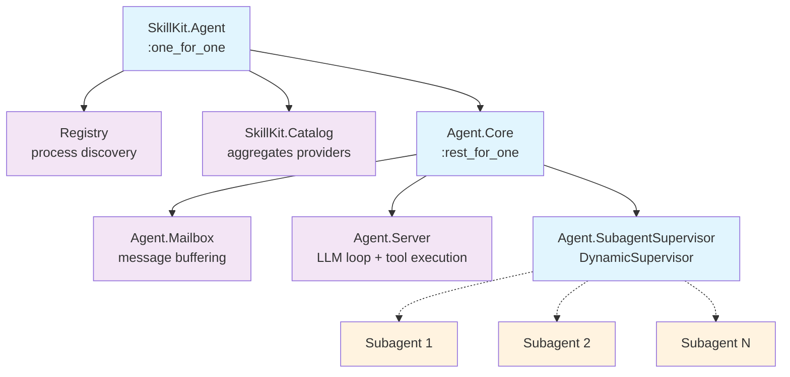

# Architecture Overview

SkillKit is an Elixir framework for building LLM agent systems. Each agent is
an isolated OTP supervision tree that buffers messages, drives an LLM loop,
executes tools, and streams events back to the caller process.

## Agent Lifecycle

The public API follows a three-step pattern:

```elixir
# Source-driven: discovers root agent from providers
{:ok, agent} = SkillKit.start_agent(
  skills: [{SkillKit.Kit.Local, dir: ".skills"}],
  caller: self(),
  scope: my_scope
)

# Or definition-driven: pass an agent definition directly
{:ok, agent} = SkillKit.start_agent(definition, skills: [...], caller: self())

:ok = SkillKit.send_message(agent, "Hello")
# ... receive events in caller process ...
:ok = SkillKit.stop_agent(agent)
```

The source-driven form resolves the agent identity from the first argument,
then delegates to the definition-driven form.

`start_agent` builds an `AgentRef` — an opaque struct holding the agent name,
a unique Registry name, and the supervisor PID. `send_message/2` routes to the
Mailbox via Registry lookup. `stop_agent/1` calls `Supervisor.stop/1` on the
root supervisor, tearing down the entire tree.

## Supervision Tree

Each agent owns its own Registry and two isolated children under a top-level
`:one_for_one` supervisor:



```
SkillKit.Agent (one_for_one)
├── Registry              (process discovery for this agent)
├── SkillKit.Catalog      (aggregates providers, builds tool defs, classifies calls)
└── Agent.Core            (rest_for_one)
    ├── Agent.Mailbox         (message buffering)
    ├── Agent.Server          (LLM loop + tool execution)
    └── Agent.SubagentSupervisor  (DynamicSupervisor)
```

**Catalog** is isolated from **Core** intentionally: a provider crash does not
restart the conversation. Within Core, `:rest_for_one` ordering ensures that if
Mailbox crashes, Server and SubagentSupervisor both restart (a Server without a
Mailbox is useless); if Server crashes, SubagentSupervisor also restarts
(orphaned subagents should not continue running).

Mailbox resolves Server via Registry lookup at flush time rather than at init,
which avoids start-order coupling within the `:rest_for_one` chain.

## Catalog

`SkillKit.Catalog` is a GenServer that aggregates kits from one or more
providers and exposes everything the Server needs: tool definitions, tool call
classification, skill lookup, agent lookup, hooks, and tool config.

**Always fresh.** Every call to the Catalog invokes `list_kits/1` on each
provider — there is no internal caching. This ensures the catalog always
reflects the current state of providers, which matters for dynamic sources like
`Kit.Memory`.

Providers implement two callbacks:

- `list_kits/1` — return all kits available for the given config
- `get_kit/2` — return a single kit by name

The Catalog unpacks kits into skills, agents, and hooks; filters skills by
authorization scope; builds `Tool` structs for the LLM; and classifies
each incoming tool call as one of: `:tool`, `:activate_skill`, `:builtin`,
`:subagent`, or `{:module_skill, skill}`.

## Message Flow

```
caller process
    |
    | SkillKit.send_message/2
    v
Agent.Mailbox  (buffers until size threshold or flush interval)
    |
    | {:mailbox_flush, messages}
    v
Agent.Server   (handle_info drives the synchronous LLM loop)
    |
    | SkillKit.LLM.stream/2
    v
LLM Provider   (HTTP stream)
    |
    | Delta chunks decoded as they arrive
    v
caller process  <-- %Event.Delta{}, %Event.ToolCallStart{}, etc.
```

The Mailbox batches messages by size or time before forwarding, decoupling
`send_message/2` (which is a `GenServer.cast`) from LLM call timing. The Server
drives the entire turn synchronously inside a single `handle_info` callback —
there is no concurrent LLM call state to manage.

## Tool Execution Loop

After receiving a streamed LLM response, the Server checks for tool calls and
loops until the model returns a response with no tools:

```mermaid
flowchart TD
    A[Server receives<br/>mailbox flush messages] --> B[Call Catalog.tool_definitions/2]
    B --> C[Call LLM, stream response to caller]
    C --> D{Tool calls<br/>present?}
    
    D -->|No| E[Send AssistantMessage<br/>to caller]
    E --> F[Done]
    
    D -->|Yes| G[Classify each call via<br/>Catalog.classify/3]
    G --> H[Dispatch pre-boundary hooks<br/>via Hooks.call/4]
    H --> I[Execute local tools via<br/>ToolExecution authorized by Scope]
    I --> J[Dispatch post-boundary hooks<br/>via Hooks.cast/3]
    J --> K[Collect results as<br/>ToolResult structs]
    K --> L[Append results to<br/>message history]
    L --> B
    
    classDef start fill:#e8f5e8
    classDef decision fill:#fff3cd
    classDef process fill:#e1f5fe
    classDef end fill:#f8d7da
    
    class A start
    class D decision
    class B,C,G,H,I,J,K,L process
    class E,F end
```

The Server calls `Catalog.classify/3` before each tool execution. Local tools
are dispatched to the configured Tool module. The loop continues until
the LLM responds with no tool calls or a halt condition is reached.

## Subagents

An agent can delegate work to a child agent by invoking a subagent tool call.
The Server looks up the child's `Agent.Definition` via `Catalog.get_agent/2`,
spawns the child under its `SubagentSupervisor`, monitors the child supervisor
PID, and continues its own turn. When the child calls `report_result` or
terminates, it delivers its result back to the parent Server via the parent's
Registry. The parent resumes with a synthesised tool result in its message
history.

Delegation depth is enforced by comparing `depth` against
`definition.max_agent_depth`. Subagents start with `depth + 1` and have no
direct caller process — they communicate only through the parent Registry.

## Key Module Boundaries

| Concern | Where to look |
|---|---|
| LLM providers (Anthropic, etc.) | `SkillKit.LLM` and `SkillKit.LLM.Anthropic` |
| Skill/kit loading (filesystem, etc.) | `SkillKit.Kit.Provider` behaviours |
| In-memory kit provider | `SkillKit.Kit.Memory` |
| Tool aggregation + classification | `SkillKit.Catalog` |
| Hook dispatch at boundaries | `SkillKit.Hooks` |
| Tool execution + hooks | `SkillKit.Tool` behaviour |
| Authorization + scope | `SkillKit.Authorization` |
| Observability | `SkillKit.Telemetry` |

See the dedicated guide pages for each of these boundaries for configuration
details and extension points.