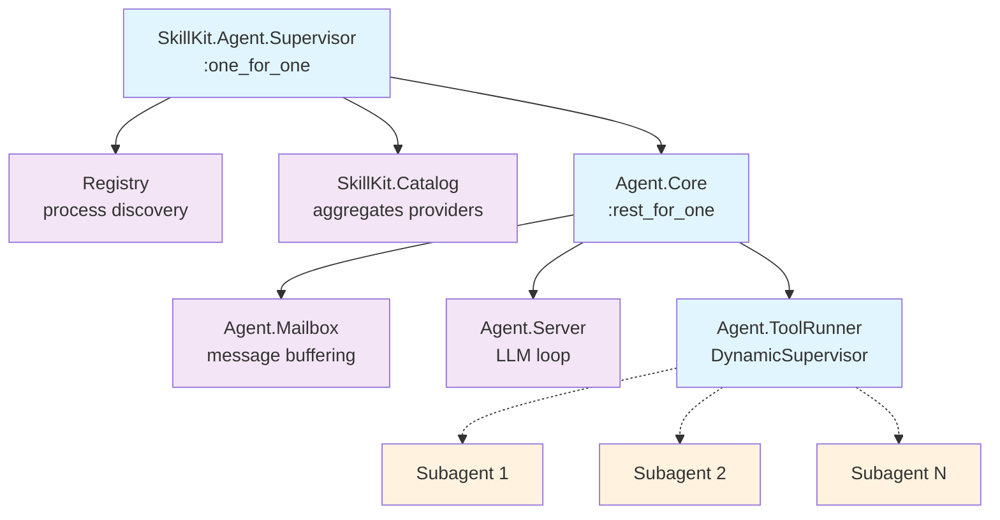
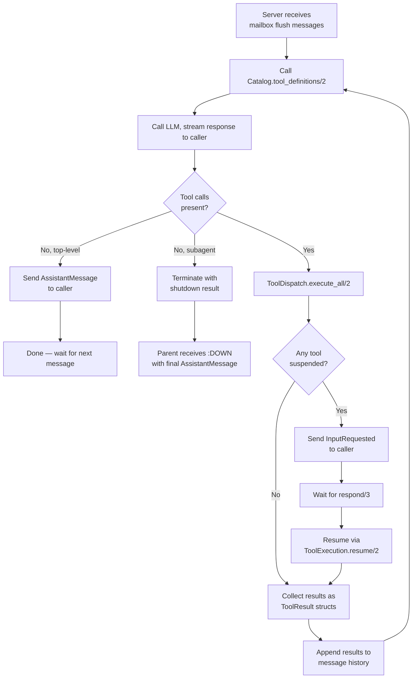

# Architecture Overview

SkillKit is an Elixir framework for building LLM agent systems. Each agent is
an isolated OTP supervision tree that buffers messages, drives an LLM loop,
executes tools, and streams events back to the caller process.

## Agent Lifecycle

The public API follows a three-step pattern:

```elixir
# 1. Start an agent
{:ok, agent} = SkillKit.start_agent(MyApp.AssistantKit, caller: self())

# 2. Send messages
:ok = SkillKit.send_message(agent, "Hello")
# ... receive events in caller process ...

# 3. Shut down
:ok = SkillKit.stop_agent(agent)
```

### Agent resolution

The first argument to `start_agent/2` identifies the agent. It accepts
several forms — all resolve to a `%SkillKit.Agent{}` before the agent starts:

| Form | Resolution |
|------|------------|
| `%Agent{}` | Used directly. |
| `"path/to/agent"` | Shorthand for `{Kit.Local, dir: "path/to/agent"}`. |
| `MyApp.Kit` | Bare module, shorthand for `{MyApp.Kit, []}`. |
| `{MyApp.Kit, opts}` | Calls `module.load_kits(opts)` and extracts the first kit with a non-nil `agent` field. |

### Auto-include of kit skills

When the agent is loaded from a provider (string, module, or tuple form),
SkillKit automatically adds that provider to the skills list. This means the
kit's own skills and sub-agents are available in the agent's tool pool without
needing to pass them separately:

```elixir
# The kit's skills are auto-included — no need to repeat in :skills
{:ok, agent} = SkillKit.start_agent(MyApp.FilesKit, caller: self())

# Additional skill sources can still be added
{:ok, agent} = SkillKit.start_agent(MyApp.FilesKit,
  skills: [{MyApp.ExtraKit, []}],
  caller: self()
)
```

When passing a `%Agent{}` directly, no auto-include happens — you must
supply all skill sources explicitly via `:skills`.

### Agent references

`start_agent` builds an `AgentRef` — an opaque struct holding the agent name,
a unique Registry name, and the supervisor PID. `send_message/2` routes to the
Mailbox via Registry lookup. `stop_agent/1` calls `Supervisor.stop/1` on the
root supervisor, tearing down the entire tree.

## Supervision Tree

Each agent owns its own Registry and two isolated children under a top-level
`:one_for_one` supervisor:



```
SkillKit.Agent.Supervisor (one_for_one)
├── Registry              (process discovery for this agent)
├── SkillKit.Catalog      (aggregates providers, builds tool defs, classifies calls)
└── Agent.Core            (rest_for_one)
    ├── Agent.Mailbox         (message buffering)
    ├── Agent.Server          (LLM loop)
    └── Agent.ToolRunner          (DynamicSupervisor)
```

**Catalog** is isolated from **Core** intentionally: a provider crash does not
restart the conversation. Within Core, `:rest_for_one` ordering ensures that if
Mailbox crashes, Server and ToolRunner both restart (a Server without a
Mailbox is useless); if Server crashes, ToolRunner also restarts
(in-flight tool calls and subagents should not continue without a Server).

Mailbox resolves Server via Registry lookup at flush time rather than at init,
which avoids start-order coupling within the `:rest_for_one` chain.

## Catalog

`SkillKit.Catalog` is a GenServer that aggregates kits from one or more
providers and exposes everything the Server needs: tool definitions, tool call
classification, skill lookup, agent lookup, hooks, and tool config.

**Always fresh.** Every call to the Catalog invokes `list_kits/1` on each
provider — there is no internal caching. This ensures the catalog always
reflects the current state of providers, which matters for dynamic sources like
`Kit.Memory`.

Providers implement two callbacks:

- `list_kits/1` — return all kits available for the given config
- `get_kit/2` — return a single kit by name

The Catalog unpacks kits into skills, agents, and hooks; filters skills by
authorization scope; builds `Tool` structs for the LLM; and classifies
each incoming tool call as one of: `:tool`, `:activate_skill`,
`:subagent`, or `{:module_skill, skill}`.

## Message Flow

```
caller process
    |
    | SkillKit.send_message/2
    v
Agent.Mailbox  (buffers until size threshold or flush interval)
    |
    | {:mailbox_flush, messages}
    v
Agent.Server   (handle_info drives the synchronous LLM loop)
    |
    | SkillKit.LLM.stream/2
    v
LLM Provider   (HTTP stream)
    |
    | Delta chunks decoded as they arrive
    v
caller process  <-- %Event.Delta{}, %Event.ToolCallStart{}, etc.
```

The Mailbox batches messages by size or time before forwarding, decoupling
`send_message/2` (which is a `GenServer.cast`) from LLM call timing. The Server
drives the entire turn synchronously inside a single `handle_info` callback —
there is no concurrent LLM call state to manage.

## Tool Execution

After receiving a streamed LLM response, the Server delegates tool execution
to `ToolDispatch.execute_all/2`. The dispatch classifies each tool call via
the Catalog and executes it with appropriate hooks. The Server loops until
the model returns a response with no tools.



Tool calls are classified by `Catalog.classify/3` as one of:
- `:tool` — shell command or registered tool module
- `{:module_skill, skill}` — kit-provided tool with a `SkillKit.Tool` implementation
- `:activate_skill` — renders a skill body and adds it to the conversation
- `:subagent` — spawns a child agent via `Runtime.start_agent/1`

Tools can return `{:pending, state}` to suspend execution. The caller
receives `%Event.InputRequested{}` and responds via `SkillKit.respond/3`.

## Subagents

An agent can delegate work to a child agent by invoking a subagent tool call.
The Server looks up the child's `%Agent{}` via `Catalog.get_agent/2`, builds
a new `%Agent{}` for the child with `parent_ref` and incremented `depth`,
and starts it via `Runtime.start_agent/1`. The child runs its LLM loop
independently. The parent monitors the child's Server process.

When the child's LLM loop completes (final text response, no more tool
calls), the child Server terminates with `{:shutdown, {:result, response}}`.
The parent's `:DOWN` handler captures the final `%AssistantMessage{}` and
injects it as a `%SystemMessage{}` into its own conversation, triggering
the next turn.

Delegation depth is enforced by comparing `depth` against
`max_agent_depth`. Subagents inherit their parent's `skills` and `runtime`
configuration from the Agent struct.

## Runtime

`SkillKit.Runtime` is a behaviour that controls how agent supervision trees
are started. The default `Runtime.Local` starts agents in the current BEAM
node. Alternative runtimes (e.g., FLAME) can start agents on remote nodes.

The behaviour defines one callback: `start_agent/2`. The public function
`Runtime.start_agent/1` reads the runtime from the Agent struct, dispatches
to the callback, and wraps the result in an `AgentRef`.

## Key Module Boundaries

| Concern | Where to look |
|---|---|
| Agent identity + configuration | `SkillKit.Agent` struct |
| Agent spawning (local, FLAME) | `SkillKit.Runtime` behaviour |
| LLM providers (Anthropic, etc.) | `SkillKit.LLM` and `SkillKit.LLM.Anthropic` |
| Skill/kit loading (filesystem, etc.) | `SkillKit.Kit.Provider` behaviours |
| In-memory kit provider | `SkillKit.Kit.Memory` |
| Tool aggregation + classification | `SkillKit.Catalog` |
| Hook dispatch at boundaries | `SkillKit.Hooks` |
| Tool dispatch + execution | `SkillKit.Agent.ToolDispatch` |
| Tool execution + hooks | `SkillKit.Tool` behaviour |
| Authorization + scope | `SkillKit.Authorization` |
| Observability | `SkillKit.Telemetry` |

See the dedicated guide pages for each of these boundaries for configuration
details and extension points.